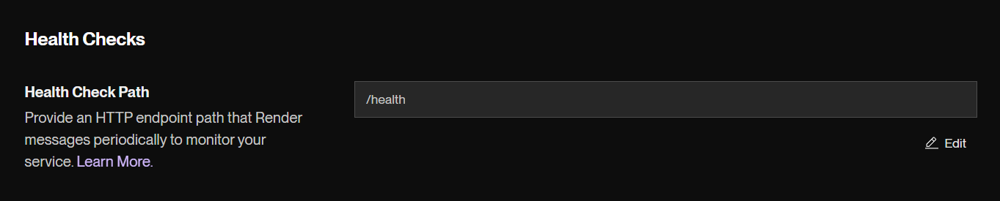
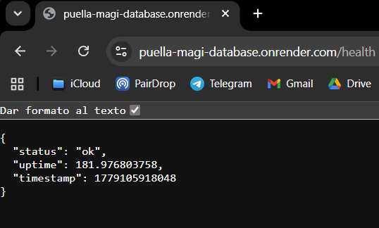
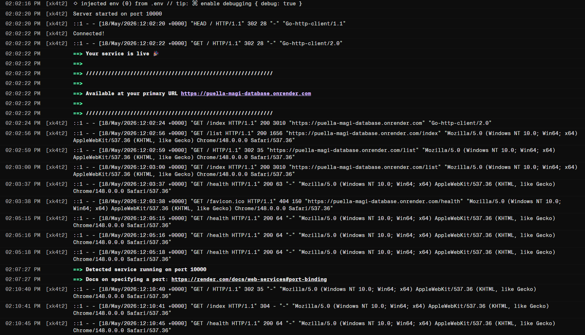
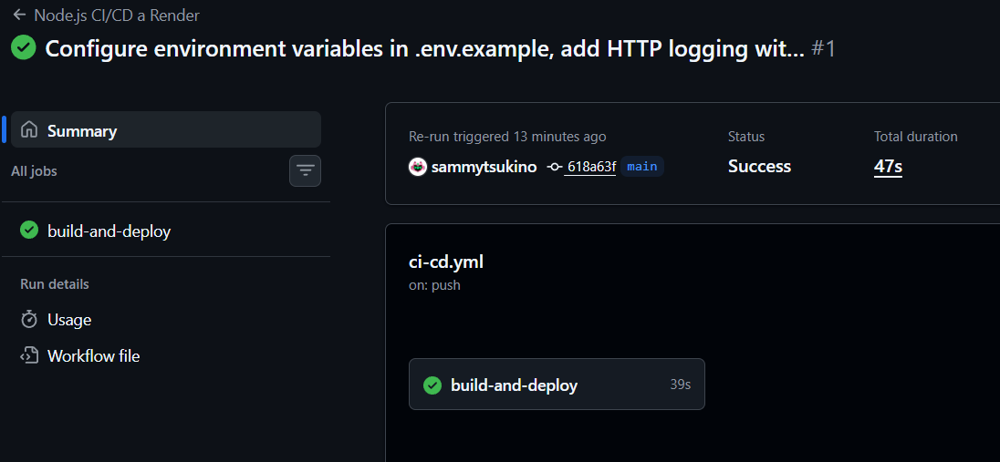

# マギカ-DB - Web API


A web application built with Express.js and MongoDB that manages data for magical girls, witches, and familiars inspired by the anime "Puella Magi Madoka Magica".

## Project Description

This project is a complete web application with REST API capabilities that allows you to create, read, update, and delete information about:

- **Magical Girls**: Main characters with their soul gem color, weapon, wish, and power level
- **Witches**: Enemies associated with magical girls, featuring barrier type and danger level
- **Familiars**: Minor creatures associated with witches

The API includes **JWT-based authentication** (register, login, refresh) and **role-based protection** on selected routes.

## Technologies Used

- **Backend**: Express.js 5.1.0
- **Database**: MongoDB + Mongoose 9.1.5
- **Template Engine**: Pug 3.0.3
- **Authentication**: jsonwebtoken, bcryptjs (password hashing)
- **Configuration**: dotenv (secrets and JWT settings)
- **Logging**: Morgan (HTTP request logs)
- **CI/CD**: GitHub Actions + Render deploy hook
- **Runtime**: Node.js

## Prerequisites

- Node.js installed
- MongoDB running
- npm or yarn

## Installation

1. **Clone the repository**
   ```bash
   git clone <repository-url>
   cd ud3-madoka
   ```

2. **Install dependencies**
   ```bash
   npm install
   ```

3. **Environment variables**
   - Copy `.env.example` to `.env`
   - Set **`JWT_SECRET`** and **`JWT_REFRESH_SECRET`** to strong, unique strings (used to sign access and refresh tokens)
   - Optionally set **`ACCESS_TOKEN_EXPIRY`** and **`REFRESH_TOKEN_EXPIRY`** (defaults are shown in `.env.example`)
   - Optionally set **`MONGO_URI`** if your MongoDB is not the default `mongodb://localhost:27017/madokadb`

4. **Configure the database**
   - Ensure MongoDB is running
   - The app reads the connection string from `MONGO_URI` in `.env`, or falls back to `mongodb://localhost:27017/madokadb` in `db.js`

5. **Start the server**
   ```bash
   npm start
   # Or directly with Node.js
   node index.js
   ```

   The server listens on **`http://localhost:8080`** by default, or on the port set in **`PORT`** (Render sets this automatically).

## Authentication (JWT)

Send the access token in the **`Authorization`** header as:

```http
Authorization: Bearer <access_token>
```

| Method | Route | Description |
|--------|-------|-------------|
| POST | `/api/register` | Register with `username` and `password` in JSON body. New users get role `user` by default. |
| POST | `/api/login` | Login; returns `{ access, refresh }` JSON Web Tokens. |
| POST | `/api/refresh` | Body: `{ "refresh": "<refresh_token>" }`; returns a new `{ access, refresh }` pair. |

**Admin-only operations:** assign the `admin` role to a user in the database (e.g. add `"admin"` to the `roles` array) to call routes that require `hasRole('admin')`.

## Project Structure

```
ud3-madoka/
├── index.js                          # Entry point (loads dotenv, connects DB, starts server)
├── app.js                            # Express app, routes, JWT auth endpoints
├── db.js                             # MongoDB connection
├── package.json
├── .env.example                      # Template for secrets (copy to .env)
├── models/
│   ├── User.js                       # Users (username, hashed password, roles)
│   ├── MagicalGirl.js
│   ├── Witch.js
│   └── Familiar.js
├── middleware/
│   └── auth.js                       # authenticate, hasRole
├── utils/
│   └── jwt.js                        # generateTokens, verifyAccessToken, verifyRefreshToken
├── test/                             # Mocha tests (JWT test secrets in test/setup.js)
├── views/                            # Pug templates
├── .github/workflows/ci-cd.yml       # CI: tests, coverage, Docker; CD: Render hook
├── Dockerfile                        # Optional container image
├── docs/screenshots/                 # Render verification captures (UD06)
└── README.md
```

## API Routes

### Health

| Method | Route | Auth | Description |
|--------|-------|------|-------------|
| GET | `/health` | No | API and database health check (200 OK or 503) |

### Authentication

See [Authentication (JWT)](#authentication-jwt) above.

### Magical Girls

| Method | Route | Auth | Description |
|--------|-------|------|-------------|
| GET | `/magicalgirls` | No | Get all magical girls (JSON) |
| GET | `/magicalgirls/:id` | No | Get a magical girl by ID (JSON) |
| POST | `/magicalgirls` | Yes (any logged-in user) | Create a new magical girl (JSON) |
| PUT | `/magicalgirls/:id` | Yes (any logged-in user) | Update a magical girl (JSON) |
| DELETE | `/magicalgirls/:id` | Yes (`admin` role) | Delete a magical girl (JSON) |

### Witches

| Method | Route | Auth | Description |
|--------|-------|------|-------------|
| GET | `/witches` | No | Get all witches (JSON) |
| GET | `/witches/:id` | No | Get a witch by ID (JSON) |
| POST | `/witches` | No | Create a new witch (JSON) |
| PUT | `/witches/:id` | No | Update a witch (JSON) |
| DELETE | `/witches/:id` | Yes (`admin` role) | Delete a witch (JSON) |

### Familiars

| Method | Route | Auth | Description |
|--------|-------|------|-------------|
| GET | `/familiars` | No | Get all familiars (JSON) |
| GET | `/familiars/:id` | No | Get a familiar by ID (JSON) |
| POST | `/familiars` | No | Create a new familiar (JSON) |
| PUT | `/familiars/:id` | No | Update a familiar (JSON) |
| DELETE | `/familiars/:id` | No | Delete a familiar (JSON) |

## Web Interface Routes

| Route | Description |
|-------|-------------|
| `/` | Home page |
| `/index` | Home page (alternative) |
| `/list` | List of magical girls |
| `/view/:id` | Magical girl detail page |
| `/new` | Create new magical girl form |
| `/edit/:id` | Edit magical girl form |
| `/process` | Process magical girl creation (POST) |
| `/process-witch` | Process witch creation (POST) |
| `/edit/:id` | Process magical girl edit (POST) |
| `/view/:id/delete` | Delete magical girl (POST) |
| `/list-witches` | List of witches |
| `/witch/:id` | Witch detail page |
| `/new-witch` | Create new witch form |
| `/edit-witch/:id` | Edit witch form |
| `/edit-witch/:id` | Process witch edit (POST) |
| `/witch/:id/delete` | Delete witch (POST) |
| `/list-familiars` | List of familiars |
| `/familiar/:id` | Familiar detail page |
| `/new-familiar` | Create new familiar form |
| `/edit-familiar/:id` | Edit familiar form |
| `/process-familiar` | Process familiar creation (POST) |
| `/edit-familiar/:id` | Process familiar edit (POST) |
| `/familiar/:id/delete` | Delete familiar (POST) |

## Data Models

### User

- `username` (String, required, unique): Login name
- `password` (String, required): Stored as a **bcrypt** hash, never in plain text
- `roles` (Array of strings, default `['user']`): Used in JWT and for `hasRole` checks (e.g. `admin`)

### Magical Girl

- `name` (String, required): Name of the magical girl
- `soulGemColor` (String, required): Color of the soul gem
- `weapon` (String, required): Weapon type (Bow, Spear, Sword, Gun, Shield, Other)
- `wish` (String): The wish granted
- `isWitch` (Boolean): Whether transformed into a witch
- `powerLevel` (Number): Power level

### Witch

- `name` (String, required): Name of the witch
- `barrierType` (String): Type of barrier
- `dangerLevel` (Number): Danger level
- `defeated` (Boolean): Whether the witch has been defeated
- `magicalGirl` (Reference): Associated magical girl
- `firstAppearance` (Date): First appearance date
- `lastSeen` (Date): Last sighting date

### Familiar

- `name` (String, required): Name of the familiar
- `witch` (Reference, required): Associated witch
- `type` (String): Type of creature
- `strength` (Number): Strength level
- `isEvolved` (Boolean): Whether it has evolved

## Deployment and maintenance

### Continuous integration and deployment

The workflow [`.github/workflows/ci-cd.yml`](.github/workflows/ci-cd.yml) runs on every **push to `main`**:

1. Spins up a **MongoDB** service container for the job environment.
2. Installs dependencies and runs **`npm test`**.
3. Calculates **test coverage** with **`npm run test:coverage`** (nyc).
4. Builds a **Docker image** (`docker build`) as an extra validation step.
5. If all steps succeed, triggers a **Render** deploy via the deploy hook secret.

Configure the deploy hook in GitHub:

1. In Render: **Settings → Deploy → Deploy Hook** (copy the URL). Disable **Auto-Deploy** so only the workflow deploys after tests pass.
2. In GitHub: **Settings → Secrets and variables → Actions → New repository secret** named `RENDER_DEPLOY_HOOK_URL` with that URL.

### Render configuration

| Setting | Value |
|---------|--------|
| **Build command** | `npm install` |
| **Start command** | `npm start` |
| **Health check path** | `/health` |
| **Auto-Deploy** | Off (deploy from GitHub Actions) |

**Environment variables** on Render (minimum):

- `MONGO_URI` — MongoDB Atlas connection string (or your production database URL).
- `JWT_SECRET`, `JWT_REFRESH_SECRET` — strong unique values (never commit them).
- `NODE_ENV` — set to `prod` for Morgan `combined` logs in production.
- `PORT` — assigned automatically by Render; do not override unless needed.

Optional: `ACCESS_TOKEN_EXPIRY`, `REFRESH_TOKEN_EXPIRY`.

### Health check

`GET /health` verifies that the API and MongoDB are reachable. On success it returns **200** with JSON:

```json
{
  "status": "ok",
  "uptime": 123.45,
  "timestamp": 1710000000000
}
```

If the database query fails, the route returns **503**. In production, Render monitors **`/health`** under **Settings → Health Checks** and can restart the service on failure.

### Logging

[Morgan](https://www.npmjs.com/package/morgan) logs every HTTP request. Format depends on `NODE_ENV`:

- `prod` → `combined` (detailed, suitable for production).
- any other value → `dev` (compact, suitable for local development).

On Render, request logs appear in the **Logs** tab (e.g. after calls to `/health` or `/list`).

### Production deployment

Live service: **https://puella-magi-database.onrender.com/**

| Area | What is in place |
|------|------------------|
| Health Checks (Render) | Path `/health` |
| Health endpoint | `GET /health` → 200 with `status: ok` when API and MongoDB respond |
| HTTP logging | Morgan `combined` logs in Render (**Logs**) with `NODE_ENV=prod` |
| CI/CD | GitHub Actions: tests, coverage (nyc), Docker build, deploy hook to Render |

Screenshots from the deployed service and dashboard:









### Docker (optional local run)

```bash
docker build -t ud3-madoka .
docker run -p 8080:8080 --env-file .env ud3-madoka
```

## Key Features

- Complete CRUD operations for all three entity types
- Data validation in models
- Relationships between entities (Witch -> MagicalGirl, Familiar -> Witch)
- Web interface with Pug templates
- REST API with JSON responses
- Error handling and validation
- Duplicate name prevention
- **JWT authentication**: registration, login, token refresh
- **Protected API routes**: some endpoints require a valid Bearer token; deletions of magical girls and witches require the **`admin`** role
- **`/health` endpoint**: checks API and MongoDB availability for Render health checks
- **HTTP logging** with Morgan (`dev` locally, `combined` when `NODE_ENV=prod`)
- **CI/CD**: GitHub Actions runs tests and coverage, builds Docker, then deploys to Render via deploy hook

## Author

Made with ♡ by SAMMYTSUKINO ~
